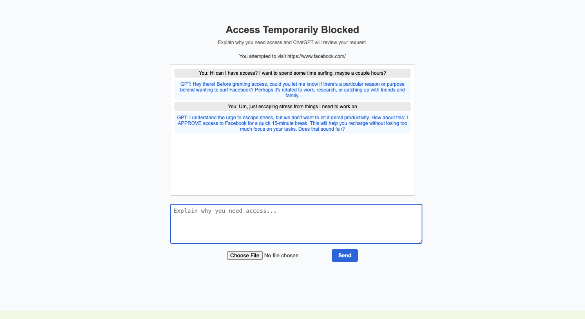

# Volition

A Chrome extension that blocks distracting websites and forces you to **negotiate with ChatGPT** before providing timed access.




https://github.com/user-attachments/assets/055eda97-531b-4805-ae42-cb8f8837ab73


---

## ✨ Key Features

| Feature | Description |
|---------|-------------|
| Default block-list | Ships with major social, news, and video sites pre-blocked. |
| ChatGPT negotiation | When you attempt to visit a blocked site, you must convince ChatGPT (via your own API key) to grant access. |
| Timed overrides | ChatGPT can grant 10 s, 5 min, 2 h, or unlimited access. A badge shows time remaining; the page re-blocks automatically. |
| Advanced auto-review | Unknown domains are sent to ChatGPT for quick **BLOCK / ALLOW** classification. |
| Proof with images | Upload a (down-sampled) screenshot/photo to prove you completed a task; ChatGPT reviews it (vision model required). |
| Model selector | gpt-3.5-turbo, gpt-4o-mini, gpt-4o, or gpt-o3. |
| Fully local data | API key and settings stay in `chrome.storage.local`; no trackers, no analytics. |

---

## 🚀 Quick Start (Unpacked)

1. Clone the repo and install dependencies (only for build tools):
   ```bash
   git clone https://github.com/jordansafer/volition.git
   cd volition
   ```
2. Load in Chrome:
   1. Visit `chrome://extensions`.
   2. Enable **Developer mode**.
   3. Click **Load unpacked** → select the project folder.
3. Click the toolbar icon → **Options**.
4. Paste your OpenAI API key and (optionally) test it.
5. Start browsing—blocked sites will redirect to the negotiation screen.

---

## 📦 Build for the Chrome Web Store

```
npm run build   # or just:  bash dist.sh
```
This script creates a **dist/** directory without the Git repo and makes `volition-dist.zip`, ready for upload.

---

## 🛠️ Development Notes

* Background logic is in `background.js` (service-worker).  
* UI pages: `options.html` / `blocked.html`.
* Icons: `icons/volition_logo.png` (source) → PNGs (16/32/48/128).
* Privacy policy is in [PRIVACY.md](./PRIVACY.md).

### NPM scripts (optional)
| Script | Purpose |
|--------|---------|
| `npm run lint` | Run ESLint on JS files. |
| `npm run build` | Generates `dist/` & zip. |

---

## 🔒 Privacy & Data

See [PRIVACY.md](./PRIVACY.md).  In short: all data remains local; the extension only talks to `api.openai.com` with your key.

---

## 📄 License

MIT © 2025
