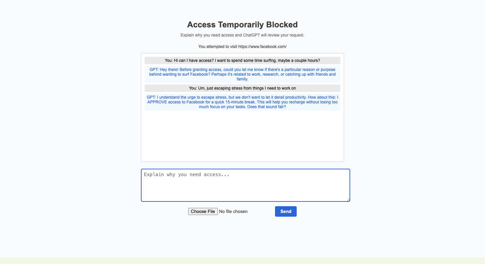

# Volition

A Chrome extension that blocks distracting websites and lets you negotiate with AI for timed access. New users can use Volition Free without configuring an API key.

Install the [Chrome Extension](https://chromewebstore.google.com/detail/volition/iempmfmcjgjdpmobhlaookjjjmbfiaeh)




https://github.com/user-attachments/assets/055eda97-531b-4805-ae42-cb8f8837ab73


---

## ✨ Key Features

| Feature | Description |
|---------|-------------|
| Default block-list | Ships with major social, news, and video sites pre-blocked. |
| AI negotiation | Use Volition Free (no API key required), or explicitly choose My OpenAI API key in Settings. Switch modes without deleting your saved key. |
| Timed overrides | AI can grant temporary or unlimited access. An injected countdown shows remaining temporary access and triggers a recheck at expiry. |
| Timed pause | Choose a partial pause (allow everything except really bad sites) or complete pause (allow everything) for N hours. Normal blocking resumes when the timer expires. |
| Really bad sites | Editable in Settings; defaults to Facebook, Reddit, and YouTube, including subdomains. These stay blocked during partial pauses even if allowlisted; outside a pause, normal blocklist/allowlist rules apply. |
| Advanced auto-review | When enabled, unknown domains are classified as **BLOCK / ALLOW** using your selected Free or BYO provider. |
| Proof with images | Upload a photo/screenshot as proof; the extension sends a downscaled JPEG to the selected service. BYO requires a vision-capable model. |
| Optional BYO settings | Configure your key, text/vision models, token limit, or compatible API endpoint. Free uses the hosted service's model settings. |
| Local records | Settings, access state, approval history, and usage statistics use `chrome.storage.local`. AI requests leave the browser; see the privacy section below. |

---

## 🚀 Quick Start (Unpacked)

1. Clone the repo (no npm dependencies are required):
   ```bash
   git clone https://github.com/jordansafer/volition.git
   cd volition
   ```
2. Load in Chrome:
   1. Visit `chrome://extensions`.
   2. Enable **Developer mode**.
   3. Click **Load unpacked** → select the project folder.
3. Click the toolbar icon → **Options**.
4. New users without a key start with **Volition Free**. Alternatively select **My OpenAI API key**, save your key, and configure your models or custom endpoint. Upgrades with a saved key and no stored mode retain BYO behavior. Existing stored modes and keys are preserved; switch modes explicitly in Settings.
5. Start browsing—blocked sites will redirect to the negotiation screen. Sending a message shares the blocked URL and conversation with your selected AI service. Enable advanced classification in Options if you also want unknown domains reviewed; it is off by default.

For a Web Store installation, install using the link above, click the toolbar icon for Settings, and start browsing. Free mode needs no user API configuration. In optional BYO mode, requests go directly to OpenAI or your configured compatible endpoint. The Test button always tests against OpenAI, even with a custom endpoint.

---

## 📦 Build for the Chrome Web Store

```
npm run build   # or just:  bash dist.sh
```
This script creates a **dist/** directory without the Git repo and makes `volition-dist.zip`, ready for upload.
The build uses Bash, rsync, and zip. Check the archive before submission; do not place credential files in the source tree. `.env` files are excluded from packaging.

### Automated releases

`.github/workflows/release.yml` builds the zip and uploads it to the Chrome Web Store.
Bump the version in `manifest.json` **and** `package.json`, then push a matching tag:

```
git tag v1.1.4 && git push origin v1.1.4
```

The workflow refuses to run if the tag and `manifest.json` disagree. You can also trigger it
by hand from the **Actions** tab, unchecking *publish* to leave a draft in the dashboard
instead of submitting for review.

It needs four repository secrets (Settings → Secrets and variables → Actions):

| Secret | Where it comes from |
|--------|---------------------|
| `CHROME_PUBLISHER_ID` | Web Store dashboard → Account. Required by the v2 upload API. |
| `CHROME_CLIENT_ID` | OAuth 2.0 **Desktop app** client in a Google Cloud project with the *Chrome Web Store API* enabled. |
| `CHROME_CLIENT_SECRET` | Same OAuth client. |
| `CHROME_REFRESH_TOKEN` | `npx chrome-webstore-upload-keys`, scope `https://www.googleapis.com/auth/chromewebstore`. |

The extension ID is not a secret — it lives in the workflow's `env` block.

> **Keep the OAuth consent screen in "In production", not "Testing."** Refresh tokens issued
> by an app in Testing status expire after 7 days, which silently breaks the release job.
> In production they do not expire on a schedule, but an unused token dies after 6 months —
> if you go that long between releases, regenerate it.

---

## 🛠️ Development Notes

* Background logic is in `background.js` (service-worker).  
* UI pages: `options.html` / `blocked.html`.
* Icons: `icons/volition_logo.png` (source) → PNGs (16/32/48/128).
* Privacy policy is in [PRIVACY.md](./PRIVACY.md).

### NPM scripts (optional)
| Script | Purpose |
|--------|---------|
| `npm test` | Run provider, migration, and classification tests using Node's test runner. |
| `npm run build` | Generates `dist/` & zip. |

---

## 🔒 Privacy & Data

Free mode sends a `messages` array over HTTPS to `https://volition-free-api-jordansafers-projects.vercel.app/api/negotiate`. Negotiation includes the full blocked URL, conversation and custom prompts, uploaded image proofs, and recent approval descriptions/timestamps. Optional classification sends the hostname and classification prompt. The stored BYO key is not sent to Free.

The recovered backend source is in [backend/](./backend/README.md). It validates and forwards message text/images to OpenAI (`gpt-4o-mini`). The handler has no database/file persistence or successful-request content logging, but logs full error objects on failures. Vercel logging/retention settings and OpenAI account data controls still require separate verification; these are not defined by the supplied source. BYO sends requests directly to OpenAI or the configured endpoint; choose an HTTPS endpoint you trust with your key.

Locally, the extension keeps settings/lists, access expiries, up to 20 approval records (including URLs and response excerpts), usage totals, and up to 100 API activity records. Full chats and raw proof images are not persisted by the extension, but remain in page memory during a conversation and are sent with subsequent messages. Diagnostic console output can include replies and errors. There is no extension analytics upload or cookie tracking. **Reset statistics** does not erase approval history. See [PRIVACY.md](./PRIVACY.md) for details and deletion limits.

---

## ❓ FAQ

### If other focus extensions have not worked for you, because you always end up disabling them or switching to another device where the extension is not setup.
How Volition approaches this: Similar to delayed gratification, you can always get through, so there is never a reason to disable/switch. Unlike delayed gratification, you can work with an LLM, adjust the prompt, etc, to get granular time limited to approval to sites you need, when you need them.

### If you have trouble breaking tasks into steps, or getting started on things.
How Volition approaches this: LLM forces you to spend a couple minutes on a task, with a concrete deliverable, before accessing your distracting site. You get your inertia, you get access to the site you wanted, and the LLM gives time limited access to disrupt any scroll cycle. It's a win-win-win.

### If you find new distracting sites that aren't in your site blocker.
Enable advanced classification to send hostnames not covered by your lists to your selected AI service. You can customize its classification prompt. Classification is off by default and respects pause settings.

### If you are concerned about privacy.
Review [PRIVACY.md](./PRIVACY.md) before sending sensitive messages or proof images. Free requests pass through Volition's Vercel backend; BYO requests go to your chosen endpoint. Custom providers are not automatically more private: their processing and retention policies differ. The extension reads URLs for blocking but does not scrape page text or automatically capture screenshots.

### If you are concerned about cost.
Volition Free does not require your own API key. Optional BYO requests use your provider account and may incur that provider's charges. Pricing, limits, and data handling depend on the provider; check its terms before configuring it.

Also, if you haven't tried other focus blockers, here are some great ones! Personally, I find delayed gratification blockers to be a step above traditional time blockers in terms of effectiveness. Although also personally, I made Volition for myself to address some limitations of delayed gratification, so this is what I currently use.

| Name | Type |
|------|------|
| [One Sec](https://oneseclabs.com/) | Delayed Gratification |
| Dopanope | Delayed Gratification |
| [RescueTime](https://www.rescuetime.com/) | Traditional Time/Productivity Tracker |
| [LeechBlock](https://www.proginosko.com/leechblock/) | Traditional Site Blocker |
| StayFocusd | Traditional Site Blocker |
| [ScreenZen](https://screenzen.co/) | Mobile (iOS/Android) |
| [Apple Parental Controls](https://support.apple.com/HT201304) | Mobile (iOS) |

---

## 📄 License

MIT © 2025
